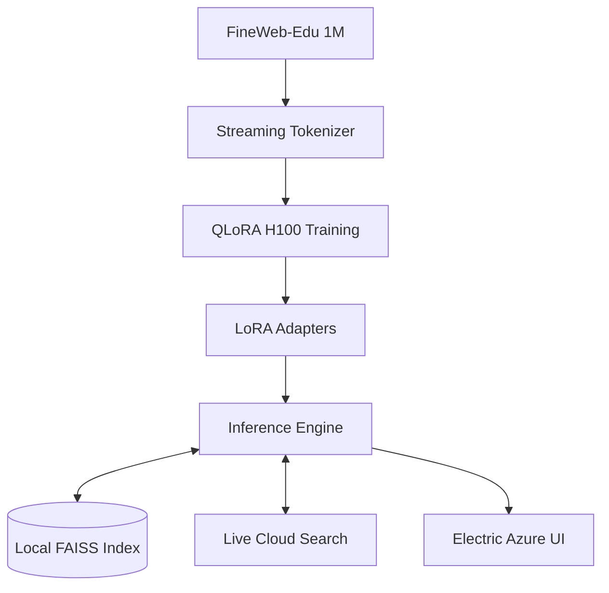

<div align="center">

# 🧠 InfoSage AI
### Advanced Local Intelligence Engine for Educational Synthesis

**A high-performance interface for Llama-2-13B, fine-tuned on the FineWeb-Edu corpus.**

[](https://huggingface.co/NousResearch/Llama-2-13b-hf)
[](https://huggingface.co/datasets/HuggingFaceFW/fineweb-edu)
[](https://www.nvidia.com/en-us/data-center/h100/)
[](https://www.nvidia.com/en-us/geforce/graphics-cards/40-series/rtx-4060-family/)
[](LICENSE)

---

**InfoSage** is a local-centric AI ecosystem designed for the synthesis of educational content. By leveraging Meta's **Llama-2-13B** architecture with a **1M sample fine-tune** from the FineWeb-Edu dataset, the system provides superior answering capabilities while ensuring complete data privacy.

</div>

---

## 🏗️ Technical Workflow

### 1. Cloud-Scale Fine-Tuning
*   **Infrastructure**: Accelerated via **NVIDIA H100 80GB** (Google Colab / Cloud).
*   **Methodology**: `QLoRA` 4-bit training with Flash Attention 2 and Gradient Checkpointing.
*   **Process**: Open `train.ipynb` in Colab, mount Google Drive, and execute. LoRA adapters and the RAG index are automatically exported to your Drive.

### 2. Artifact Relocation
Once training is finalized, relocate the output artifacts to the local project structure for inference:
*   Move adapters to: `out/final_model/`
*   Move FAISS index to: `out/rag_index/`

### 3. Local Synthesis Engine
*   **Inference Hardware**: Consumer-grade **NVIDIA RTX** (e.g., 4060 8GB).
*   **Deployment**: Low-VRAM mapping (`7500MiB` limit) with SDPA attention for Windows compatibility.

---

## Key Capabilities

*   **Hybrid RAG Pipeline**: Integrates local FAISS vector search with a live HuggingFace fallback mechanism for real-time knowledge synthesis.
*   **Precision Text Synthesis**: Integrated word segmentation post-processing to ensure human-grade readability and fix fine-tuning artifacts.
*   **Electric Azure UI**: Premium glassmorphism interface with real-time VRAM/GPU diagnostics.

---

## Technical Architecture



---

## Deployment & Usage

### ⚙️ System Requirements
*   **GPU**: NVIDIA RTX (Minimum 8GB Dedicated VRAM)
*   **RAM**: 16GB System Memory
*   **Setup**: `pip install torch transformers datasets faiss-cpu sentence-transformers peft bitsandbytes accelerate wordsegment`

### 🖥️ Running the Application

**Option 1: Desktop Interface (Recommended)**
```bash
python gui/app.py
# Access via http://localhost:5000
```

**Option 2: Terminal Mode**
```bash
python chat_llm.py
```

**Option 3: RAG Maintenance**
```bash
# Rebuild the local knowledge base separately if needed
python build_rag_index.py
```

---

## System Configuration

| Parameter | Specification |
| :--- | :--- |
| **Compute Architecture** | NVIDIA H100 80GB HBM3 |
| **Quantization** | 4-Bit NF4 + Double Quantization |
| **Attention Mechanism** | Flash Attention 2 (Training) / SDPA (Inference) |
| **Optimization** | 8-bit AdamW / BFloat16 Training Precision |
| **Dataset Scale** | 1,000,000 Educational Samples |

---

<div align="center">
  <sub>Developed for privacy-conscious intelligence. Licensed under the MIT framework.</sub>
</div>
